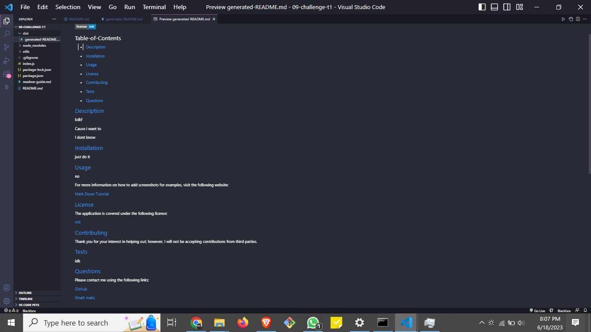

  # Professional-README-Generator
  
   

  ## Table-of-Contents

  * [User Story](#user-story)
  * [Acceptance Criteria](#acceptance-criteria)
  * [Installation](#installation)
  * [Usage](#usage)
  * [Tests](#tests)

  ## [User Story](#user-story)

  ```md
  AS A developer
  I WANT a README generator
  SO THAT I can quickly create a professional README for a new project
  ```

  [Acceptance Criteria](#acceptance-criteria)

  ```md
  GIVEN a command-line application that accepts user input
  WHEN I am prompted for information about my application repository
  THEN a high-quality, professional README.md is generated with the title of my project and sections entitled Description, Table of Contents, Installation, Usage, License, Contributing, Tests, and Questions
  WHEN I enter my project title
  THEN this is displayed as the title of the README
  WHEN I enter a description, installation instructions, usage information, contribution guidelines, and test instructions
  THEN this information is added to the sections of the README entitled Description, Installation, Usage, Contributing, and Tests
  WHEN I choose a license for my application from a list of options
  THEN a badge for that license is added near the top of the README and a notice is added to the section of the README entitled License that explains which license the application is covered under
  WHEN I enter my GitHub username
  THEN this is added to the section of the README entitled Questions, with a link to my GitHub profile
  WHEN I enter my email address
  THEN this is added to the section of the README entitled Questions, with instructions on how to reach me with additional questions
  WHEN I click on the links in the Table of Contents
  THEN I am taken to the corresponding section of the README
  ```

  ## [Installation](#table-of-contents)

  Click the repository link below. Download the zip file and copy it to a directory of your choice or clone to a directory of your choice using your terminal.  Open the file in VS Code or whatever editor you work with. Open the terminal in VS Code and make sure you’re in the root directory ‘challenge-9-professional-README-generator. You’ll now be ready to run the app!

  [Tutorial on how to use app](https://drive.google.com/file/d/1RZ0JZQiEg8VZoxKCngcEDxdre6pK6-LP/view)
  
  README Screenshot No License
  

  ## [Usage](#table-of-contents)

  After installation is complete, run the following code: 'node index.js' or 'npm start' in the terminal. Answer the prompts and after completion, you should see a console log showing your answers to your prompts, a message that says ‘File created!’, and you should see your file under the ‘dist’ folder called ‘generatedREADME’. It’s generated in mark down syntax so you can copy and paste that code into your project!
 

  ## [Tests](#table-of-contents)

  To test this app, open up the file in VS Code. Open the terminal, change directory into the root folder ‘challenge-9-professional-README-generator’, and run ‘node index.js’. Answer the prompts and view the preview of the ‘generated-README.md’ file in the ‘dist’ folder.

